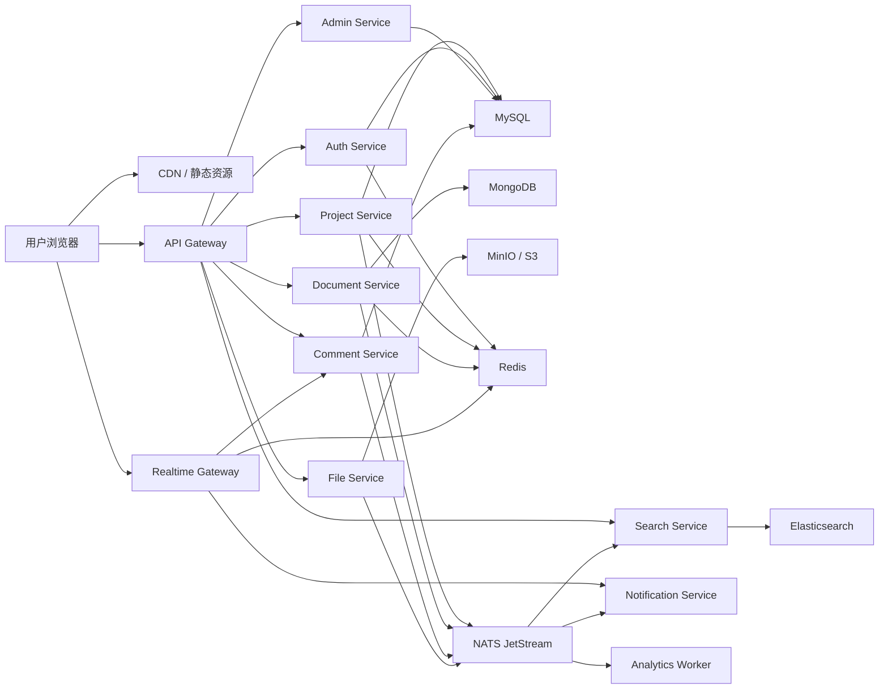
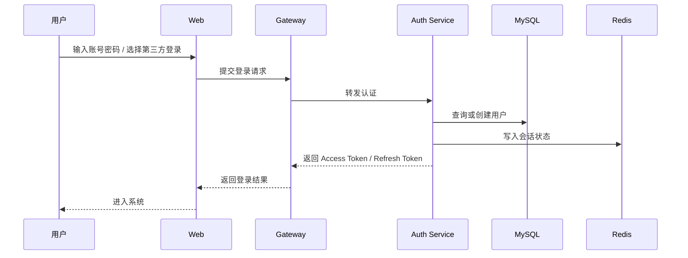
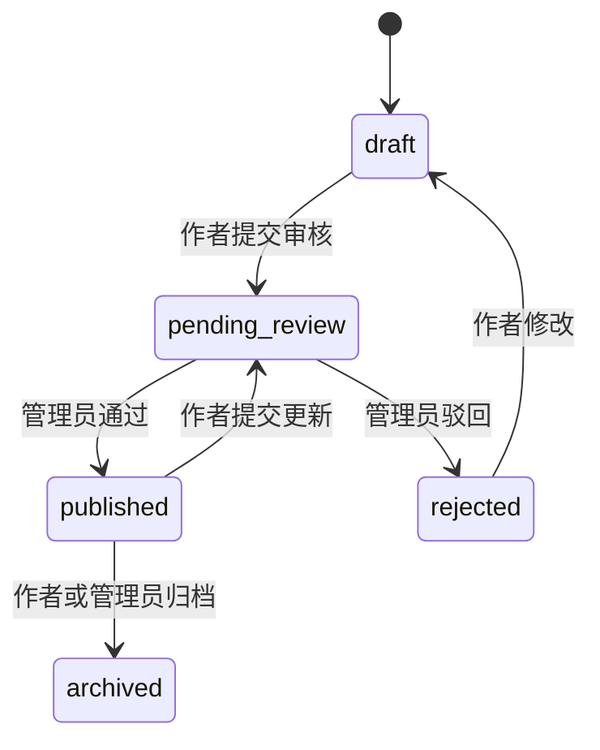
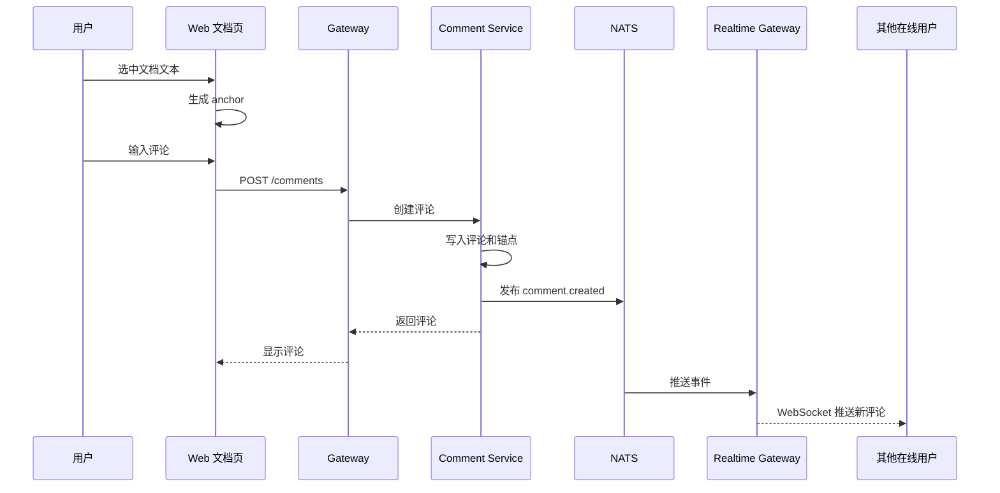

# 新猿译码 技术文档

## 1. 文档目标

本文档基于 [requirements.md](./requirements.md) 编写，用于指导“新猿译码”一期系统设计、技术选型、模块拆分、数据建模、接口规划、部署规划和交付排期。

一期目标是在一个月内上线可用版本，核心能力包括项目浏览、项目详情、在线文档只读展示、文档选区评论、评论实时推送、文档下载、代码包下载、开放注册、GitHub 登录、微信登录、项目审核和中文界面。

本文档会同时说明二期可扩展方向，但技术实现优先服务一期交付。

## 2. 技术原则

1. 前后端分离：前端负责用户体验、渲染和交互，后端负责业务、权限、数据和文件处理。
2. 微服务架构：按业务边界拆分服务，避免一个服务承载所有职责。
3. 一期可落地：架构具备扩展性，但不为了“微服务完整度”牺牲交付速度。
4. 内容安全优先：Markdown、富文本、评论、外链视频和文件上传都必须经过安全处理。
5. 性能优先：项目列表、文档阅读、代码展示、搜索和下载链路都要避免阻塞。
6. 事件驱动：下载统计、通知、搜索索引、实时评论等非主链路能力通过消息队列异步处理。
7. 可观测：服务日志、指标、链路追踪和审计日志在一期就要预留。
8. 设计统一：前端设计落地 Apple 风格设计规范，以简洁、留白、阅读友好和单一蓝色交互为主。

## 3. 总体架构

整体架构采用 React 前端 + Go 微服务 + API Gateway + MySQL + MongoDB + Redis + Elasticsearch + MinIO + NATS 的组合。



### 3.1 一期部署形态

一期可以采用“微服务代码结构 + Docker Compose 单机/小集群部署”的方式。服务边界清晰，但不强制一开始就上 Kubernetes。

推荐一期部署：

1. 前端：静态构建产物部署到 Nginx 或对象存储 + CDN。
2. 后端：多个 Go 服务以容器方式部署。
3. 数据与中间件：MySQL、MongoDB、Redis、Elasticsearch、MinIO、NATS。
4. 网关：Nginx 或 Traefik 负责反向代理和 TLS。
5. 可观测：Prometheus、Grafana、Loki 可作为一期增强项。

### 3.2 二期部署演进

当访问量增长后，可演进到 Kubernetes：

1. 每个服务独立 Deployment。
2. NATS、MySQL、MongoDB、Elasticsearch 使用托管服务或独立集群。
3. 文件转码、索引构建、统计任务通过 Worker 横向扩容。
4. WebSocket 网关按连接数独立扩容。

## 4. 技术栈选型

## 4.1 前端技术栈

| 类型 | 技术 | 用途 |
| --- | --- | --- |
| 基础框架 | React + TypeScript | 前端应用开发 |
| 构建工具 | Vite | 快速开发、打包和 HMR |
| 路由 | React Router | 前台、作者后台、管理后台路由 |
| 数据请求 | TanStack Query | 服务端状态、缓存、重试、分页 |
| 本地状态 | Zustand | 登录态、UI 状态、评论面板状态 |
| UI 样式 | CSS Tokens + Tailwind CSS | Apple 风格设计系统落地 |
| 图标 | Lucide React | 工具按钮、导航、操作图标 |
| Markdown 渲染 | react-markdown + remark-gfm | 文档正文渲染 |
| 代码高亮 | Shiki 或 Highlight.js | 代码展示与文档代码块 |
| 代码浏览 | Monaco Editor 只读模式 | 代码文件预览 |
| 流程图 | Mermaid | 流程图、时序图、状态图 |
| PDF 预览 | PDF.js | PDF 文档在线预览 |
| 实时通信 | WebSocket Client | 评论、回复和通知实时推送 |
| 表单 | React Hook Form + Zod | 表单校验和类型约束 |
| 测试 | Vitest + React Testing Library + Playwright | 单测、组件测试和端到端测试 |

### 4.1.1 前端架构分层

```text
apps/web
  src
    app              # 应用入口、路由、Provider
    pages            # 页面级组件
    features         # 业务功能模块
    components       # 通用 UI 组件
    design-system    # Apple 风格 tokens、基础组件
    api              # API Client
    stores           # Zustand 状态
    hooks            # 通用 hooks
    utils            # 工具函数
    types            # TypeScript 类型
```

### 4.1.2 前端性能策略

1. 路由级代码分割，后台页面和文档页按需加载。
2. Mermaid、PDF.js、Monaco Editor 作为重资源延迟加载。
3. 首页图片、项目封面图懒加载，并使用 WebP。
4. 项目列表分页加载，必要时列表虚拟滚动。
5. 文档目录、标题锚点和评论锚点在前端缓存。
6. 评论实时推送只订阅当前文档、当前项目和当前用户相关频道。

### 4.1.3 在线文档与编辑器路线

一期在线文档采用 Markdown 只读渲染 + 独立选区评论层，不引入富文本编辑器、Yjs 或协同编辑运行时。这样能将一个月上线范围稳定在“阅读、定位评论、下载、审核”四条核心链路。

二期需要作者在线编辑和多人协作时，推荐采用 Tiptap + Yjs + Hocuspocus 的技术路线，并以 DocFlow 为参考实现，按需抽取编辑器、协同连接、权限校验和版本快照的实现思路，而不是将其整体作为新猿译码的底座。

Hocuspocus 可作为独立的 Node.js 协同网关部署，通过 JWT 校验用户后连接 MongoDB；它只负责 Yjs 同步与在线状态，项目、权限、审核和评论主业务仍由 Go 服务负责。这不会改变“Go 微服务”为核心后端的技术边界。

选择理由：

1. DocFlow 是块级 Markdown/富文本文档协作产品，能力结构与新猿译码的教程、API 文档、设计说明最接近。
2. Tiptap 的扩展模型适合代码块、Mermaid、Bilibili 嵌入、附件和评论锚点等技术文档节点。
3. Yjs 只在二期处理“多人同时编辑同一份文档”的冲突合并；一期评论实时推送只需要 WebSocket + NATS，不需要 CRDT。
4. 需要保存的主格式仍以 Markdown 为准，Tiptap JSON 仅作为编辑态/渲染辅助数据，保证 md 下载、搜索索引和 GitHub 同步的兼容性。

`docx-editor` 不作为项目文档主编辑器。它擅长浏览器内保真编辑 DOCX、修订、批注和让 AI Agent 对 Word 文档提出可接受或拒绝的修改；因此更适合作为后续“DOCX 导入审阅”或“AI 红线审查”独立模块。只有当产品主场景改为企业 Word 合同与交付文档协作时，才应将它提升为主编辑内核。

## 4.2 后端技术栈

| 类型 | 技术 | 用途 |
| --- | --- | --- |
| 语言 | Go | 微服务开发 |
| HTTP 框架 | Gin 或 Fiber | 外部 REST API |
| RPC | gRPC | 内部服务调用 |
| API 网关 | Nginx / Traefik + Gateway Service | 统一入口、鉴权、限流 |
| 关系数据库 | MySQL 8.0 | 用户、项目、权限、评论、审核、通知等强关系与事务数据 |
| 文档数据库 | MongoDB | Markdown 正文、解析内容块、文档树、版本快照、二期 Yjs 持久化预留 |
| 缓存 | Redis | 会话缓存、热点项目、限流、实时连接状态 |
| 搜索 | Elasticsearch 8.x | 项目、文档、代码文件名搜索 |
| 对象存储 | MinIO / S3 | 文档文件、代码包、图片、附件 |
| 消息队列 | NATS JetStream | 事件发布、异步任务、实时通知扇出 |
| 配置 | Viper | 服务配置 |
| 日志 | zap / slog | 结构化日志 |
| 链路追踪 | OpenTelemetry | 分布式追踪 |
| API 文档 | OpenAPI | REST 接口说明 |
| 数据迁移 | golang-migrate | MySQL 迁移 |
| 鉴权 | JWT + Refresh Token + OAuth2 | 登录态、GitHub、微信登录 |

### 4.2.1 存储选型边界

| 系统 | 一期职责 | 不承担的职责 |
| --- | --- | --- |
| MySQL | 用户、角色、项目元数据、审核、评论线程、资源记录、通知、审计和统计 | 文档正文及版本快照、全文搜索 |
| MongoDB | Markdown 原文、标题大纲、内容块、文档版本快照，以及二期 Yjs 更新流预留 | 用户权限、审核状态、下载统计等强事务业务数据 |
| Elasticsearch | 项目、文档和代码文件名的检索索引与高亮 | 业务主数据和唯一事实来源 |

选择 MySQL 而不是 PostgreSQL 的原因不是功能缺失，而是一期业务模型以常规关系、分页筛选和事务写入为主，MySQL 的团队普及度、托管资源和 Go 驱动生态更利于压缩上线风险。MongoDB 仍保留，是因为文档正文与版本快照天然是聚合文档，采用当前文档 + 历史版本集合能够避免大字段频繁更新和复杂跨表拼装。

Elasticsearch 替代 OpenSearch，是为了使用团队更熟悉的索引、调试和生态工具；一期以 `ngram` 自定义分析器提供基础中文召回。默认 Elasticsearch 发行版使用 Elastic License 2.0，部署前须确认不将搜索能力作为独立托管服务对外售卖；若未来需要纯宽松许可证发行版，再切换到 OpenSearch 并保持 Search Service 接口不变。

### 4.2.2 Go 服务代码结构

```text
services
  gateway
  auth-service
  project-service
  document-service
  comment-service
  file-service
  search-service
  notification-service
  admin-service
  analytics-worker
pkg
  auth
  config
  errors
  logger
  middleware
  pagination
  response
  security
  tracing
api
  openapi
  proto
deploy
  docker-compose.yml
  nginx
  observability
```

## 5. 服务拆分

## 5.1 Gateway Service

职责：

1. 对前端提供统一 REST API。
2. 处理基础鉴权、CORS、限流、请求 ID、日志。
3. 聚合项目详情、文档摘要、下载资源等组合数据。
4. 转发 WebSocket 鉴权请求给 Realtime Gateway。

不负责：

1. 不直接访问数据库。
2. 不承载具体业务规则。

## 5.2 Auth Service

职责：

1. 用户注册、登录、退出。
2. 密码哈希和校验。
3. JWT Access Token 和 Refresh Token 管理。
4. GitHub OAuth 登录。
5. 微信扫码登录。
6. 第三方账号绑定。
7. 角色和基础权限查询。

关键设计：

1. 密码使用 Argon2id 或 bcrypt 存储。
2. Access Token 短有效期，Refresh Token 长有效期并支持撤销。
3. GitHub 和微信账号统一写入 `oauth_accounts` 表。
4. 同邮箱账号合并需经过用户确认，避免误绑定。

## 5.3 Project Service

职责：

1. 项目创建、编辑、草稿保存。
2. 项目列表、筛选、排序。
3. 项目详情。
4. 分类、标签、技术栈。
5. 项目收藏、关注。
6. 项目版本和发布状态。
7. 项目审核状态流转。

关键设计：

1. 项目默认状态为 `draft`。
2. 提交审核后变为 `pending_review`。
3. 管理员通过后变为 `published`。
4. 已发布项目再次编辑时创建修订版本，审核通过后替换线上版本。

## 5.4 Document Service

职责：

1. 文档树管理。
2. Markdown 文档内容保存。
3. 文档只读展示。
4. 文档版本快照。
5. 文档导出 md、pdf。
6. 文档锚点、标题大纲生成。

关键设计：

1. 一期不做在线编辑，作者后台上传或粘贴 Markdown。
2. 文档内容存 MongoDB，保留原始 Markdown、解析后的结构化块和版本快照。
3. PDF 可通过后台任务生成，也可由作者上传。
4. 文档内容变化后发布 `document.updated` 事件，触发搜索索引更新。

## 5.5 Comment Service

职责：

1. 项目普通评论。
2. 文档选区评论。
3. 评论回复。
4. 评论编辑、删除、解决、隐藏。
5. 评论锚点定位。
6. 评论事件发布。

评论锚点策略：

1. 保存文档 ID、文档版本、选中文本、前后文片段。
2. 保存结构化定位：块 ID、字符起止位置。
3. 保存兼容定位：Text Quote Selector，包括 exact、prefix、suffix。
4. 文档内容变更后优先使用块 ID 定位，失败后用文本匹配恢复。
5. 定位失败时展示“位置可能已变化”。

## 5.6 Realtime Gateway

职责：

1. 提供 WebSocket 连接。
2. 按文档、项目、用户建立订阅。
3. 推送评论创建、回复、编辑、删除和解决状态变化。
4. 推送站内通知未读数变化。
5. 处理断线重连和心跳。

技术策略：

1. 前端进入文档页后订阅 `document:{document_id}`。
2. 登录用户同时订阅 `user:{user_id}`。
3. Comment Service 写入评论后发布 NATS 事件。
4. Realtime Gateway 消费事件并推送给在线连接。
5. 多实例部署时使用 Redis 记录连接路由，或每个实例都订阅 NATS 后本地匹配连接。

## 5.7 File Service

职责：

1. 文档文件上传和下载。
2. 代码包上传和下载。
3. 图片上传。
4. 文件类型校验。
5. 文件 Hash 计算。
6. 下载链接签名。
7. 下载统计事件发布。

一期支持格式：

1. 文档：md、pdf。
2. 代码包：zip、tar.gz。
3. 图片：png、jpg、jpeg、webp、svg。
4. 附件：json、yaml、csv、txt。
5. 视频：不上传，仅保存 Bilibili 链接。

安全策略：

1. 文件名标准化，禁止使用原始路径。
2. 文件类型基于扩展名和 MIME 双重校验。
3. 私有文件通过短期签名 URL 下载。
4. 所有下载行为发布 `file.downloaded` 事件。

## 5.8 Search Service

职责：

1. 项目搜索。
2. 标签、分类、技术栈搜索。
3. 文档全文搜索。
4. 代码文件名搜索。
5. 搜索关键词高亮。

技术策略：

1. Elasticsearch 保存可搜索索引。
2. Project、Document、File 事件触发索引更新。
3. 一期不搜索代码全文，只搜索代码文件名、README 摘要和项目元数据。
4. 中文搜索一期使用自定义 `ngram` 分词器，避免依赖第三方插件；召回和准确率需要增强时，再评估 IK 分词插件。

## 5.9 Notification Service

职责：

1. 生成站内通知。
2. 维护未读数量。
3. 标记已读。
4. 通知跳转链接。
5. 向 Realtime Gateway 推送用户级通知。

触发事件：

1. 评论回复。
2. 文档批注回复。
3. 批注被解决。
4. 项目审核通过。
5. 项目审核驳回。
6. 项目新版本发布。
7. 下载资源更新。

## 5.10 Admin Service

职责：

1. 项目审核。
2. 项目更新审核。
3. 用户管理。
4. 评论治理。
5. 分类标签管理。
6. 推荐位管理。
7. 举报处理。
8. 操作日志。

关键设计：

1. 所有管理员操作写入审计日志。
2. 审核动作必须记录审核人、审核意见、审核时间。
3. 下架内容保留历史记录，不做物理删除。

## 5.11 Analytics Worker

职责：

1. 浏览量统计。
2. 下载量统计。
3. 收藏数、评论数聚合。
4. 作者后台数据概览。
5. 管理后台平台指标。

技术策略：

1. 高频事件先进入 NATS。
2. Worker 批量聚合写入 MySQL。
3. 热点计数可先写 Redis，再定时落库。

## 6. 数据存储设计

## 6.1 MySQL

MySQL 8.0 存储强关系、事务和运营类数据。文档正文与快照不放入 MySQL，由 MongoDB 单独承载。

核心表：

```text
users
oauth_accounts
roles
user_roles
projects
project_versions
project_categories
tags
project_tags
project_tech_stacks
favorites
follows
comments
comment_replies
reviews
download_resources
notifications
audit_logs
metrics_daily
```

### 6.1.1 users

| 字段 | 类型 | 说明 |
| --- | --- | --- |
| id | uuid | 用户 ID |
| username | varchar | 用户名 |
| email | varchar | 邮箱 |
| password_hash | varchar | 密码哈希 |
| avatar_url | text | 头像 |
| status | varchar | normal、disabled |
| created_at | timestamp | 创建时间 |
| updated_at | timestamp | 更新时间 |

### 6.1.2 oauth_accounts

| 字段 | 类型 | 说明 |
| --- | --- | --- |
| id | uuid | 记录 ID |
| user_id | uuid | 用户 ID |
| provider | varchar | github、wechat |
| provider_user_id | varchar | 第三方用户 ID |
| union_id | varchar | 微信 unionid |
| nickname | varchar | 第三方昵称 |
| avatar_url | text | 第三方头像 |
| created_at | timestamp | 创建时间 |

### 6.1.3 projects

| 字段 | 类型 | 说明 |
| --- | --- | --- |
| id | uuid | 项目 ID |
| owner_id | uuid | 作者 ID |
| slug | varchar | URL 标识 |
| name | varchar | 项目名称 |
| summary | text | 一句话简介 |
| description | text | 详细介绍 |
| cover_url | text | 封面图 |
| license | varchar | 许可证 |
| status | varchar | draft、pending_review、published、rejected、archived |
| current_version_id | uuid | 当前线上版本 |
| created_at | timestamp | 创建时间 |
| updated_at | timestamp | 更新时间 |

### 6.1.4 comments

| 字段 | 类型 | 说明 |
| --- | --- | --- |
| id | uuid | 评论 ID |
| project_id | uuid | 项目 ID |
| document_id | varchar | 文档 ID |
| user_id | uuid | 评论人 |
| type | varchar | project、document_selection |
| content | text | 评论内容 |
| selected_text | text | 被评论原文 |
| anchor | json | 选区定位信息 |
| status | varchar | open、resolved、hidden、deleted |
| created_at | timestamp | 创建时间 |
| updated_at | timestamp | 更新时间 |

### 6.1.5 download_resources

| 字段 | 类型 | 说明 |
| --- | --- | --- |
| id | uuid | 资源 ID |
| project_id | uuid | 项目 ID |
| version_id | uuid | 项目版本 ID |
| name | varchar | 资源名称 |
| type | varchar | code_package、document、attachment |
| object_key | text | 对象存储路径 |
| file_size | bigint | 文件大小 |
| file_hash | varchar | 文件 Hash |
| visibility | varchar | public、private |
| status | varchar | active、removed |
| download_count | bigint | 下载次数 |
| created_at | timestamp | 上传时间 |

## 6.2 MongoDB

MongoDB 存储文档正文、结构化内容块和版本快照。文档数据读写以 `document_id` 为边界，避免与 MySQL 的项目、审核和评论事务形成跨库写入。

集合：

```text
documents
document_versions
yjs_updates
```

### 6.2.1 documents

```json
{
  "_id": "doc_uuid",
  "project_id": "project_uuid",
  "parent_id": "parent_doc_uuid",
  "title": "快速开始",
  "slug": "quick-start",
  "format": "markdown",
  "status": "published",
  "order": 10,
  "current_version": 3,
  "created_at": "2026-07-26T00:00:00Z",
  "updated_at": "2026-07-26T00:00:00Z"
}
```

### 6.2.2 document_versions

```json
{
  "_id": "doc_version_uuid",
  "document_id": "doc_uuid",
  "version": 3,
  "raw_markdown": "# 快速开始\n...",
  "outline": [
    { "id": "install", "level": 2, "title": "安装" }
  ],
  "blocks": [
    {
      "id": "block_uuid",
      "type": "paragraph",
      "text": "安装依赖并启动服务。"
    }
  ],
  "created_by": "user_uuid",
  "created_at": "2026-07-26T00:00:00Z"
}
```

`documents` 保存目录和当前版本元数据，`document_versions` 保存原始 Markdown、标题大纲与不可变内容块快照。评论锚点通过 `document_version + block_id + 文本引用` 关联，避免把定位能力绑定到某个编辑器实现。`yjs_updates` 一期不写入业务数据，仅预留集合、索引与生命周期策略，二期协同编辑启用。

## 6.3 Redis

Redis 用途：

1. 登录会话和 Refresh Token 黑名单。
2. 热点项目详情缓存。
3. 文档目录缓存。
4. 限流计数。
5. WebSocket 在线用户状态。
6. 未读通知数缓存。
7. 下载量、浏览量临时计数。

## 6.4 Elasticsearch

索引：

1. `projects_index`：项目名称、简介、标签、技术栈、作者、许可证。
2. `documents_index`：文档标题、正文、项目名称。
3. `files_index`：代码包内文件名、README 摘要。

## 6.5 MinIO / S3

Bucket 规划：

1. `public-assets`：公开图片、封面图。
2. `documents`：md、pdf 文档文件。
3. `code-packages`：zip、tar.gz 代码包。
4. `attachments`：附件资源。
5. `generated`：生成的 PDF、缩略图等。

## 7. 接口设计

## 7.1 API 风格

外部 API 使用 REST + JSON，内部服务使用 gRPC。

统一响应结构：

```json
{
  "code": "OK",
  "message": "success",
  "data": {},
  "request_id": "req_xxx"
}
```

错误响应：

```json
{
  "code": "UNAUTHORIZED",
  "message": "请先登录",
  "details": {},
  "request_id": "req_xxx"
}
```

## 7.2 认证接口

| 方法 | 路径 | 说明 |
| --- | --- | --- |
| POST | `/api/v1/auth/register` | 注册 |
| POST | `/api/v1/auth/login` | 账号密码登录 |
| POST | `/api/v1/auth/logout` | 退出 |
| POST | `/api/v1/auth/refresh` | 刷新 Token |
| GET | `/api/v1/auth/github/authorize` | 获取 GitHub 授权地址 |
| GET | `/api/v1/auth/github/callback` | GitHub 回调 |
| GET | `/api/v1/auth/wechat/authorize` | 获取微信授权地址 |
| GET | `/api/v1/auth/wechat/callback` | 微信回调 |
| GET | `/api/v1/me` | 当前用户 |

## 7.3 项目接口

| 方法 | 路径 | 说明 |
| --- | --- | --- |
| GET | `/api/v1/projects` | 项目列表 |
| GET | `/api/v1/projects/{slug}` | 项目详情 |
| POST | `/api/v1/projects` | 创建项目 |
| PUT | `/api/v1/projects/{id}` | 编辑项目 |
| POST | `/api/v1/projects/{id}/submit-review` | 提交审核 |
| POST | `/api/v1/projects/{id}/favorite` | 收藏 |
| DELETE | `/api/v1/projects/{id}/favorite` | 取消收藏 |
| GET | `/api/v1/projects/{id}/versions` | 版本列表 |

## 7.4 文档接口

| 方法 | 路径 | 说明 |
| --- | --- | --- |
| GET | `/api/v1/projects/{project_id}/docs/tree` | 文档树 |
| GET | `/api/v1/docs/{doc_id}` | 文档详情 |
| POST | `/api/v1/docs` | 创建文档 |
| PUT | `/api/v1/docs/{doc_id}` | 更新文档 |
| GET | `/api/v1/docs/{doc_id}/download?format=md` | 下载 md |
| GET | `/api/v1/docs/{doc_id}/download?format=pdf` | 下载 pdf |
| GET | `/api/v1/docs/{doc_id}/comments` | 文档评论列表 |

## 7.5 评论接口

| 方法 | 路径 | 说明 |
| --- | --- | --- |
| POST | `/api/v1/comments` | 创建评论 |
| POST | `/api/v1/comments/{id}/replies` | 回复评论 |
| PUT | `/api/v1/comments/{id}` | 编辑评论 |
| DELETE | `/api/v1/comments/{id}` | 删除评论 |
| POST | `/api/v1/comments/{id}/resolve` | 解决评论 |
| POST | `/api/v1/comments/{id}/reopen` | 重新打开评论 |

创建文档选区评论请求：

```json
{
  "project_id": "project_uuid",
  "document_id": "doc_uuid",
  "type": "document_selection",
  "content": "这里建议补一个部署示例。",
  "selected_text": "启动服务",
  "anchor": {
    "document_version": 3,
    "block_id": "block_uuid",
    "start_offset": 12,
    "end_offset": 16,
    "quote": {
      "exact": "启动服务",
      "prefix": "安装依赖并",
      "suffix": "即可访问"
    }
  }
}
```

## 7.6 文件接口

| 方法 | 路径 | 说明 |
| --- | --- | --- |
| POST | `/api/v1/files/upload` | 上传文件 |
| GET | `/api/v1/files/{id}/download` | 下载文件 |
| POST | `/api/v1/projects/{id}/code-packages` | 上传代码包 |
| GET | `/api/v1/projects/{id}/code-tree` | 代码目录 |
| GET | `/api/v1/projects/{id}/code-files/{file_id}` | 代码文件内容 |

## 7.7 搜索接口

| 方法 | 路径 | 说明 |
| --- | --- | --- |
| GET | `/api/v1/search?q=xxx&type=all` | 全局搜索 |
| GET | `/api/v1/search/projects?q=xxx` | 项目搜索 |
| GET | `/api/v1/search/docs?q=xxx` | 文档搜索 |

## 7.8 管理接口

| 方法 | 路径 | 说明 |
| --- | --- | --- |
| GET | `/api/v1/admin/reviews` | 审核列表 |
| POST | `/api/v1/admin/reviews/{id}/approve` | 审核通过 |
| POST | `/api/v1/admin/reviews/{id}/reject` | 审核驳回 |
| GET | `/api/v1/admin/users` | 用户管理 |
| GET | `/api/v1/admin/audit-logs` | 操作日志 |
| POST | `/api/v1/admin/recommendations` | 推荐位配置 |

## 7.9 WebSocket 协议

连接地址：

```text
wss://domain.com/realtime?token=ACCESS_TOKEN
```

客户端订阅：

```json
{
  "type": "subscribe",
  "channels": ["document:doc_uuid", "project:project_uuid", "user:user_uuid"]
}
```

评论推送：

```json
{
  "type": "comment.created",
  "channel": "document:doc_uuid",
  "payload": {
    "comment_id": "comment_uuid",
    "document_id": "doc_uuid",
    "user": {
      "id": "user_uuid",
      "name": "开发者"
    },
    "content": "这里建议补一个部署示例。",
    "anchor": {}
  }
}
```

通知推送：

```json
{
  "type": "notification.unread_count_changed",
  "channel": "user:user_uuid",
  "payload": {
    "unread_count": 5
  }
}
```

## 8. 核心流程设计

## 8.1 注册和登录流程



## 8.2 项目发布审核流程



## 8.3 文档选区评论流程



## 8.4 代码包上传和展示流程

1. 作者上传 zip 或 tar.gz。
2. File Service 校验文件类型、大小和 Hash。
3. 文件写入 MinIO。
4. File Service 发布 `code_package.uploaded` 事件。
5. Worker 解压安全检查，提取目录树、README 和文件元数据。
6. Search Service 索引文件名和 README 摘要。
7. 前端代码浏览页展示目录树和只读代码内容。

安全要求：

1. 解压必须防 Zip Slip 路径穿越。
2. 单文件大小、总文件数、解压后总大小必须有限制。
3. 二进制文件不展示内容，只显示下载。

## 8.5 文档下载流程

1. 用户点击下载 md 或 pdf。
2. Gateway 校验项目和资源权限。
3. Document Service 查询当前文档版本。
4. md 直接返回原始 Markdown。
5. pdf 若已生成则返回签名下载链接，未生成则触发后台生成任务。
6. File Service 记录下载事件。

## 8.6 Bilibili 视频嵌入流程

1. 作者在项目后台填写 Bilibili 视频链接。
2. 后端校验链接域名和视频 ID 格式。
3. 前端使用安全 iframe 白名单渲染。
4. iframe 加 `sandbox`、`allowfullscreen` 和最小必要权限。
5. 加载失败时展示“去 Bilibili 查看”的外链入口。

## 9. 安全设计

## 9.1 鉴权与权限

1. Access Token 用于接口访问。
2. Refresh Token 用于续期，支持撤销。
3. 后端所有写操作必须校验权限。
4. 管理接口必须校验管理员角色。
5. 项目作者只能编辑自己的项目。
6. 管理员操作写入审计日志。

## 9.2 内容安全

1. Markdown 渲染前后都要做 XSS 过滤。
2. 禁止 Markdown 中执行脚本。
3. 外链图片和视频使用白名单策略。
4. Bilibili iframe 使用受控组件生成，不允许用户直接提交 iframe HTML。
5. 评论内容过滤危险 HTML。

## 9.3 文件安全

1. 上传文件校验 MIME、扩展名和文件头。
2. 代码包解压使用安全路径校验。
3. SVG 需要清洗或转成安全资源后再展示。
4. 文件下载使用签名 URL。
5. 私有文件不暴露真实存储路径。

## 9.4 接口安全

1. 登录、注册、评论、上传接口限流。
2. 管理接口记录 IP、用户 ID、请求 ID。
3. 所有接口返回统一错误码，不暴露内部堆栈。
4. CORS 只允许正式域名和开发环境域名。
5. 生产环境必须启用 HTTPS。

## 10. 性能设计

## 10.1 前端性能

1. 首页首屏资源控制在合理范围内。
2. 文档页按需加载 Mermaid、PDF.js、Monaco。
3. 项目封面使用缩略图。
4. 代码大文件超过阈值时提示下载，不直接渲染。
5. 评论面板分页加载，实时新评论插入顶部或对应线程。

## 10.2 后端性能

1. 项目列表必须分页。
2. 项目详情、文档目录、热门项目走 Redis 缓存。
3. 搜索走 Elasticsearch，不直接扫数据库。
4. 下载统计异步写入。
5. PDF 生成、代码包解析、搜索索引更新走 Worker。
6. WebSocket 按频道推送，避免全量广播。

## 10.3 数据库性能

MySQL 索引建议：

1. `projects(status, updated_at)`。
2. `projects(owner_id, status)`。
3. `comments(document_id, status, created_at)`。
4. `comments(project_id, type, created_at)`。
5. `download_resources(project_id, status)`。
6. `notifications(user_id, read_at, created_at)`。

MongoDB 索引建议：

1. `documents(project_id, parent_id, status, order)`。
2. `documents(project_id, slug)` 唯一索引。
3. `document_versions(document_id, version)` 唯一索引。

## 11. 可观测与运维

## 11.1 日志

所有服务输出结构化 JSON 日志：

1. `request_id`
2. `user_id`
3. `service`
4. `method`
5. `path`
6. `status`
7. `latency_ms`
8. `error_code`

## 11.2 指标

核心指标：

1. API 请求量、错误率、延迟。
2. WebSocket 在线连接数。
3. 评论推送成功率。
4. 文件上传成功率。
5. 下载量。
6. 搜索延迟。
7. 队列积压量。
8. 数据库连接数。

## 11.3 链路追踪

使用 OpenTelemetry 贯穿 Gateway、业务服务、数据库、队列和 Worker，便于定位慢请求。

## 11.4 告警

一期至少配置：

1. 服务不可用。
2. 错误率过高。
3. 数据库连接耗尽。
4. 磁盘空间不足。
5. 队列积压过高。
6. WebSocket 推送异常。

## 12. 前端设计落地

## 12.1 Design Tokens

从 `design-md/apple/DESIGN.md` 抽取基础 token：

```css
:root {
  --color-primary: #0066cc;
  --color-primary-focus: #0071e3;
  --color-primary-on-dark: #2997ff;
  --color-ink: #1d1d1f;
  --color-canvas: #ffffff;
  --color-parchment: #f5f5f7;
  --color-hairline: #e0e0e0;
  --radius-sm: 8px;
  --radius-lg: 18px;
  --radius-pill: 9999px;
}
```

## 12.2 页面风格

1. 前台首页和项目详情：大留白、低装饰、清晰标题层级。
2. 项目列表：信息密度更高，卡片半径不超过 8px 或遵循设计规范的 18px utility card。
3. 文档页：阅读优先，正文宽度控制，左右栏可收起。
4. 后台页面：更工具化，表格、筛选器、状态标识清晰。
5. 交互色统一使用 Apple 风格蓝色。
6. 不使用大面积彩色渐变和装饰性阴影。

## 13. 环境规划

## 13.1 本地开发环境

1. Node.js：前端开发。
2. Go：后端服务。
3. Docker Compose：数据库、中间件、对象存储。
4. Makefile 或 Taskfile：统一启动命令。

推荐命令：

```bash
make dev
make test
make lint
make migrate
```

## 13.2 环境划分

| 环境 | 用途 |
| --- | --- |
| local | 本地开发 |
| dev | 联调环境 |
| staging | 上线前验收 |
| production | 生产环境 |

## 13.3 配置管理

配置通过环境变量注入：

```text
APP_ENV
DATABASE_URL
MONGO_URI
REDIS_URL
NATS_URL
ELASTICSEARCH_URL
S3_ENDPOINT
S3_ACCESS_KEY
S3_SECRET_KEY
JWT_SECRET
GITHUB_CLIENT_ID
GITHUB_CLIENT_SECRET
WECHAT_APP_ID
WECHAT_APP_SECRET
```

敏感配置不得提交到仓库。

## 14. 测试策略

## 14.1 前端测试

1. 组件测试：按钮、表单、项目卡片、文档评论组件。
2. 页面测试：首页、项目列表、文档页。
3. E2E：登录、项目浏览、评论、下载。
4. 视觉检查：桌面端、平板端、移动端关键页面截图。

## 14.2 后端测试

1. 单元测试：权限、锚点解析、文件校验、状态流转。
2. 集成测试：项目创建审核、评论实时事件、文件上传下载。
3. API 测试：OpenAPI 契约测试。
4. 压测：项目列表、文档详情、WebSocket 连接。

## 14.3 上线前验收

必须通过：

1. 用户注册、GitHub 登录、微信登录。
2. 项目创建、提交审核、审核通过。
3. 项目列表和详情展示。
4. 文档展示、选区评论、评论实时推送。
5. md、pdf 下载。
6. zip、tar.gz 代码包上传和下载。
7. Bilibili 链接嵌入。
8. 管理员审核和审计日志。
9. 常见 XSS 和非法文件上传测试。
10. 移动端核心页面可用性测试。

## 15. 一期交付排期

以一个月上线为目标，建议按 4 周推进。

## 15.1 第 1 周：基础骨架与核心模型

目标：

1. 前端 React 工程基础结构。
2. 后端 Go 多服务目录结构。
3. Docker Compose 基础设施。
4. MySQL、MongoDB、Redis、Elasticsearch、MinIO、NATS 初始化。
5. 用户、项目、文档、评论、文件基础模型。
6. 登录注册基础接口。

交付物：

1. 可启动的前后端本地环境。
2. 数据库迁移脚本。
3. OpenAPI 初稿。

## 15.2 第 2 周：项目、文档、文件和审核

目标：

1. 项目列表、详情、创建、编辑。
2. 项目审核流程。
3. Markdown 文档展示。
4. md、pdf 文档下载。
5. 代码包上传、下载、目录解析。
6. Bilibili 视频链接保存和展示。

交付物：

1. 项目前台核心页面。
2. 作者后台创建项目流程。
3. 管理后台审核流程。

## 15.3 第 3 周：评论、实时推送、搜索与通知

目标：

1. 文档选区评论。
2. 评论回复、编辑、删除、解决。
3. WebSocket 实时推送。
4. 站内通知。
5. Elasticsearch 搜索。
6. GitHub 登录和微信登录。

交付物：

1. 文档页评论闭环。
2. 第三方登录闭环。
3. 搜索可用版本。

## 15.4 第 4 周：优化、测试、上线准备

目标：

1. Apple 风格视觉精修。
2. 移动端适配。
3. 权限、安全和文件校验。
4. 性能优化。
5. E2E 测试。
6. 部署脚本和上线文档。

交付物：

1. staging 环境。
2. 上线检查清单。
3. 可发布的一期版本。

## 16. 风险与应对

| 风险 | 影响 | 应对 |
| --- | --- | --- |
| 一个月周期较紧 | 功能无法全部精修 | 严格按必须、尽量、可延期分级 |
| 微信登录申请周期不确定 | 登录能力受阻 | 先完成接口适配和配置位，等待正式 AppID |
| 文档选区定位复杂 | 评论锚点漂移 | 一期采用块 ID + 文本引用双策略 |
| WebSocket 多实例复杂 | 实时推送不稳定 | 一期先单实例或少量实例，使用 NATS 扇出 |
| PDF 生成耗时 | 下载体验差 | 优先支持作者上传 PDF，自动生成作为后台任务 |
| 代码包解压安全 | 文件攻击风险 | 严格限制大小、路径、文件数量和类型 |
| Elasticsearch 中文分词配置 | 搜索效果波动 | 一期先用 ngram 保证项目和文档标题搜索，全文效果持续调优 |

## 17. 二期技术演进

1. GitHub 仓库同步。
2. 在线文档富文本编辑器：已采用 Milkdown Crepe，持久化格式保持 Markdown。
3. 多人协同编辑：已采用 Milkdown collaboration plugin + Yjs，自托管 WebSocket 同步与 MySQL 快照持久化服务；项目所有者可管理 `editor` / `viewer` 权限，编辑者在项目详情页直接修改已发布文档并看到在线成员与远程光标。
4. 文档版本对比。
5. AI 文档摘要、问答和代码解释。
6. 公开 API。
7. 推荐系统。
8. 企业空间。
9. Kubernetes 部署。
10. 更完整的风控和内容审核系统。

## 18. 技术结论

一期推荐采用 React + TypeScript + Vite 作为前端基础，Go 微服务作为后端基础，MySQL 承载关系和事务数据，MongoDB 承载文档正文、内容块和版本快照，Redis 做缓存和状态，Elasticsearch 做搜索，MinIO 做对象存储，NATS JetStream 做事件驱动和实时消息中转。

该方案兼顾主流技术栈、性能、美观、扩展性和一个月上线约束。核心实现优先级应始终围绕“项目可浏览、文档可阅读、评论可协作、资源可下载、内容可审核”展开。
